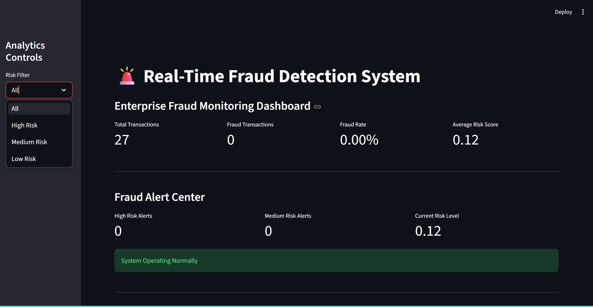
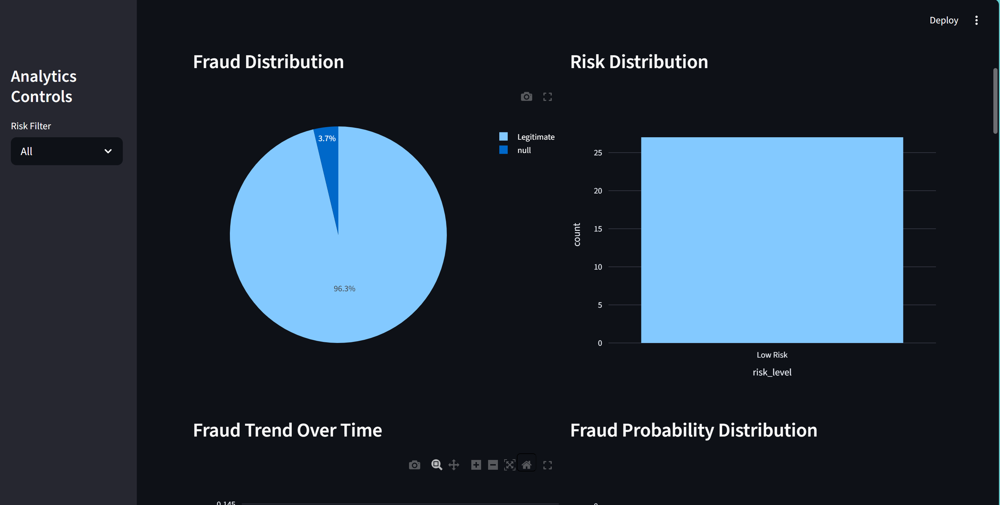
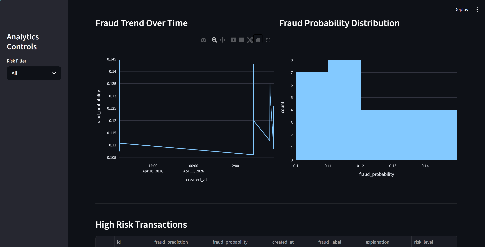
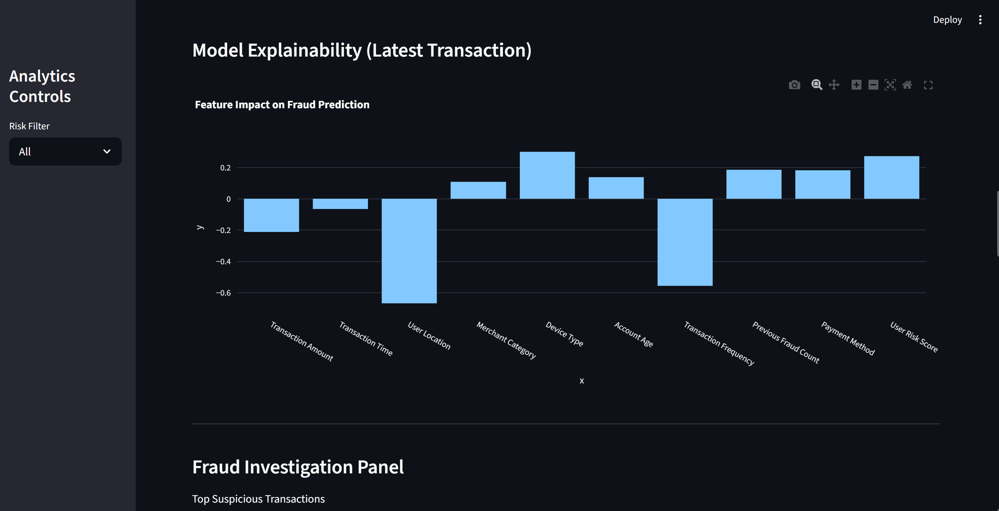

# Real-Time Fraud Detection System


An end-to-end AI-powered fraud detection system that identifies fraudulent financial transactions in real time using Machine Learning, FastAPI, SQL Server, and Streamlit.

Built on the IEEE-CIS Fraud Detection Dataset, this project simulates a production-grade fraud detection pipeline by combining feature engineering, ensemble machine learning models, API deployment, database integration, and an interactive monitoring dashboard.

---

#  Project Highlights

✅ Real-time Fraud Detection

✅ Ensemble Machine Learning Models

✅ FastAPI Deployment

✅ Interactive Streamlit Dashboard

✅ SQL Server Database Integration

✅ Feature Engineering Pipeline

✅ Model Explainability Ready

✅ Production-Oriented Architecture

---

# Project Demo

## Dashboard












---

#  Business Problem

Financial fraud causes billions of dollars in losses every year.

The objective of this project is to detect suspicious transactions before approval by analyzing transaction behavior and generating a fraud risk score in real time.

The system helps financial institutions:

- Reduce fraud losses
- Improve transaction security
- Detect suspicious activities instantly
- Support fraud investigation teams

---

# System Architecture

```text
Transaction Data
       │
       ▼
Data Preprocessing
       │
       ▼
Feature Engineering
       │
       ▼
Ensemble ML Models
(XGBoost + LightGBM + Random Forest)
       │
       ▼
Fraud Prediction API
      (FastAPI)
       │
       ├── Store Results (SQL Server)
       │
       └── Display Results (Streamlit Dashboard)
```

---

#  Technology Stack

| Category | Technologies |
|-----------|-------------|
| Programming Language | Python |
| Machine Learning | XGBoost, LightGBM, Random Forest |
| Data Processing | Pandas, NumPy, Scikit-Learn |
| API Development | FastAPI |
| Dashboard | Streamlit |
| Database | SQL Server |
| Model Serialization | Pickle |
| Version Control | Git, GitHub |
| Dataset | IEEE-CIS Fraud Detection |

---

#  Dataset

This project uses the IEEE-CIS Fraud Detection Dataset from Kaggle.

### Dataset Features

- Transaction Information
- Identity Information
- Categorical Variables
- Numerical Variables
- Fraud Labels

Dataset Link:

https://www.kaggle.com/competitions/ieee-fraud-detection

---

# 📁 Project Structure

```text
real-time-fraud-detection-system/

├── api/
│   ├── app.py
│   └── schema.py
│
├── dashboard/
│   └── app.py
│
├── database/
│   ├── db_connection.py
│   └── insert_data.py
│
|--images/
|    |-img1.png
│
├── notebooks/
│   ├── 01_eda.ipynb
│   ├── 02_feature_engineering.ipynb
│   └── model_training.ipynb
│
├── src/
│   └── predict.py
│
├── requirements.txt
├── main.py
└── README.md
```

---

#  Machine Learning Pipeline

## Data Preprocessing

- Missing Value Handling
- Outlier Detection
- Feature Scaling
- Data Cleaning
- Feature Selection

## Feature Engineering

- Transaction-Based Features
- Card-Based Features
- Email Domain Features
- Statistical Aggregations

## Models Used

| Model | Purpose |
|---------|---------|
| XGBoost | High-performance gradient boosting |
| LightGBM | Fast and scalable boosting |
| Random Forest | Ensemble-based classification |
| Ensemble Model | Final fraud prediction |


# API Endpoint

## Predict Transaction

### Request

```http
POST /predict
```

### Sample Input

```json
{
  "TransactionAmt": 150.75,
  "ProductCD": "W",
  "card1": 9500,
  "card2": 321,
  "addr1": 315
}
```

### Sample Response

```json
{
  "is_fraud": false,
  "fraud_probability": 0.034,
  "risk_level": "LOW"
}
```

---

# Database Integration

All transactions and predictions are automatically stored in SQL Server for:

- Auditing
- Monitoring
- Historical Analysis
- Future Model Retraining

---

#  Dashboard Features

The Streamlit Dashboard provides:

- Real-Time Fraud Monitoring
- Transaction Analytics
- Prediction History
- Fraud Risk Distribution
- Interactive Visualizations

---

#  Running the Project

## Clone Repository

```bash
git clone https://github.com/your-username/real-time-fraud-detection-system.git

cd real-time-fraud-detection-system
```

## Create Virtual Environment

### Windows

```bash
python -m venv venv

venv\Scripts\activate
```

### Linux / Mac

```bash
python3 -m venv venv

source venv/bin/activate
```

---

## Install Dependencies

```bash
pip install -r requirements.txt
```

---

## Run FastAPI Server

```bash
uvicorn main:app --reload
```

API URL:

```text
http://localhost:8000
```

Swagger Documentation:

```text
http://localhost:8000/docs
```

---

## Run Streamlit Dashboard

```bash
streamlit run dashboard/app.py
```

Dashboard URL:

```text
http://localhost:8501
```

---

#  Future Improvements

- SHAP Explainable AI
- Model Drift Detection
- Docker Deployment
- CI/CD Pipeline
- Kafka Integration
- AWS Deployment
- Azure Deployment
- Real-Time Streaming Architecture

---

# Author

## Mehtab Ansari

AI Engineer | Machine Learning Engineer | Data Scientist

### Connect With Me

- GitHub: https://github.com/mehtab-ansari350
- Email: mehtaban321@gmail.com

---

#  Why This Project Matters

This project demonstrates expertise across the complete AI development lifecycle:

- Data Analysis
- Feature Engineering
- Machine Learning
- Model Evaluation
- Model Deployment
- REST API Development
- Database Integration
- Dashboard Development
- End-to-End AI System Design

It reflects the skills expected from AI Engineers, Machine Learning Engineers, and Data Scientists working on real-world intelligent systems.

---
